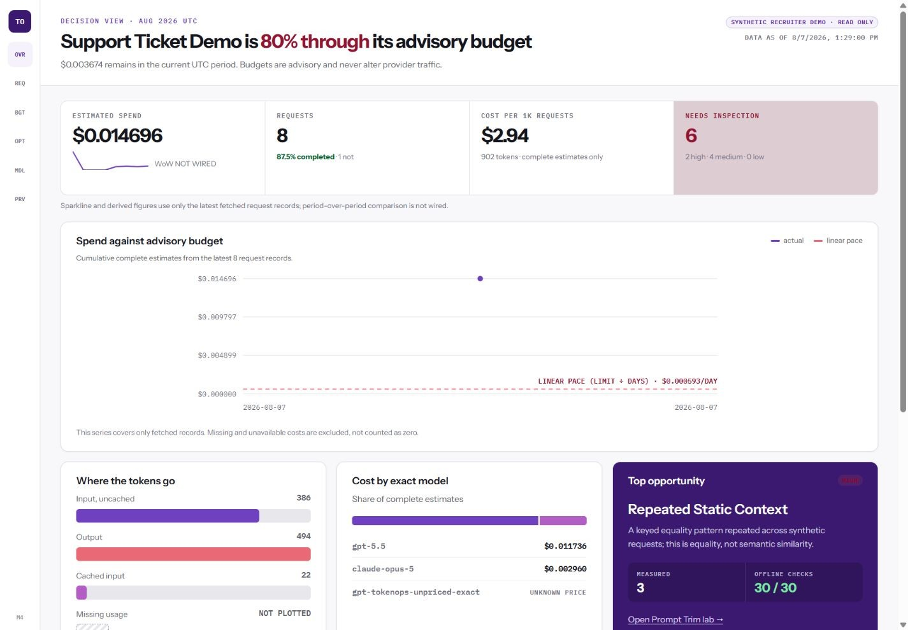
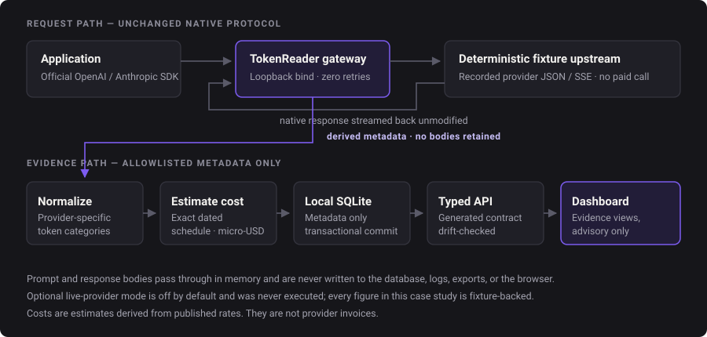
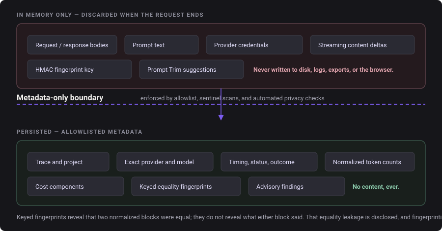
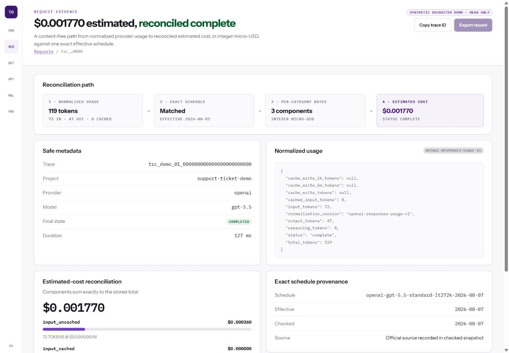

# TokenOps — Technical Case Study

**TokenOps** is a local-first, metadata-only gateway and dashboard that records how an application
uses LLM tokens, estimates cost from exact dated provider price schedules, raises advisory budgets
and explainable findings, and tests whether a leaner prompt preserves required structure — without
ever storing prompt or response content.

> ### Portfolio case study — source not published
>
> This repository contains **documentation only**. It holds no application source code, tests,
> package manifests, configuration, database schemas, migrations, scripts, or build output. The
> TokenOps implementation lives in a private repository and is not distributed here.
>
> Everything below describes a **local MVP validated against deterministic fixtures**. No real
> provider request was ever made, no production deployment exists, and there are no users, customers,
> or revenue outcomes to report.
>
> **This repository is not open source.** No permission is granted to reuse, modify, redistribute,
> host, or deploy Mattie Labs' original materials. See the [rights notice](RIGHTS.md);
> [NOTICE.md](NOTICE.md) is the primary detailed notice.

*Every screen in this case study renders synthetic fixture data. The `SYNTHETIC RECRUITER DEMO ·
READ ONLY` label is part of the product, not part of the screenshot.*

---

## The user and the problem

The intended user is a technically fluent solo developer or small AI team — someone who ships
LLM-backed features and then cannot answer basic operational questions from a provider invoice.

An invoice reports a monthly total. It does not tell you:

- which application request consumed which tokens;
- whether usage was cached, reasoned, or written to cache;
- why a cost estimate is incomplete rather than zero;
- whether a proposed prompt reduction quietly destroyed a required instruction.

TokenOps sits between an application's official provider SDK and the upstream API, forwards the
native request unchanged, and records content-free operational evidence on the way through. It is
deliberately an **instrument, not a controller**: it does not route, retry, enforce budgets, or
rewrite prompts in the live request path.

## Status

**Local MVP — Week 4 complete, verdict PASS under the local metadata-only workflow.**

Validation runs against a deterministic fixture upstream over real localhost HTTP using the official
OpenAI and Anthropic Python SDKs. Optional live-provider evaluation exists in code but is off by
default, double-gated, capped, and **was never executed**. Public release of the software remains
blocked pending a licence decision.

## Core capabilities

| Capability | What it does |
|---|---|
| Native provider-compatible gateway | Forwards OpenAI Responses and Anthropic Messages traffic unchanged, including streaming, with zero retries |
| Usage normalization | Maps provider-specific usage into shared fields without flattening cached, reasoning, or cache-write categories |
| Exact dated pricing | Matches on provider, exact model, mode, UTC date, and context band — no prefix, family, or nearest-model guessing |
| Estimated cost | Independently rounded integer micro-USD components reconciled to a total, with honest incomplete states |
| Advisory budgets | UTC-month limits per project that warn and never block, delay, reroute, or modify traffic |
| Explainable findings | Six bounded metadata findings that each cite a measured value, a configured threshold, and what to verify |
| Keyed equality fingerprints | Reveal repeated context without storing readable text, with the equality leakage disclosed |
| Prompt Trim | A deterministic, conservative, opt-in, in-memory suggestion lab that protects structure it cannot prove is safe to touch |
| Offline evaluation | A fixed 30-ticket synthetic corpus with deterministic rubrics and a content-free report |
| Static recruiter demo | The same React views over a checked synthetic snapshot, with no backend, database, key, or network |

## Interface design

The redesigned dashboard uses a light, off-white evidence workspace rather than a conventional dark
operations console. Instrument Sans carries hierarchy and prose; IBM Plex Mono distinguishes trace
IDs, timestamps, compact labels, and numeric evidence. Purple is reserved for navigation and action,
magenta for opportunities, teal for success, amber for warnings, and red for destructive states.

A 64px evidence rail becomes bottom navigation at mobile width. Evidence groups collapse from three
columns to two and then one, while tables and wide charts keep bounded local scrolling. The reviewed
minimum viewport is 320px. Missing values appear as `UNAVAILABLE`, `NOT WIRED`, or a dedicated hatch
rather than zero. Small charts are dependency-free SVGs with text labels or accessible names; they
render management-API or checked-snapshot values, never numbers copied from a mockup.

The interaction design follows the same evidence boundary: selected request shortcuts expose
`aria-pressed`, Prompt Trim suggestions remain opt-in and do not echo prompt text into comparison
panels, and fingerprint reset requires exact typed confirmation with focus trapping and restoration.
This is tested and browser-reviewed behaviour, not an accessibility certification.

## Architecture overview

An application's official SDK is pointed at the local gateway. The gateway assigns a trace
identifier, strips credentials and internal headers, validates the Host header, refuses client-chosen
upstreams, and forwards to its single configured fixture with no retries. The native JSON or SSE
response streams back unmodified.

On a separate path, the gateway derives allowlisted metadata, normalizes provider-reported usage,
matches an exact dated price schedule, computes an integer micro-USD estimate, and commits the whole
record transactionally to local SQLite. A generated, drift-checked API contract feeds a React
dashboard. Business calculations are not duplicated in the browser.

Details: [architecture and data flow](docs/02-architecture-and-data-flow.md).

## The metadata-only privacy boundary

Content retention was considered and **rejected outright** — not made opt-in. Provider and Prompt
Trim content is processed in memory and discarded. Raw bodies and events, credentials, arbitrary
headers, HMAC key material, provider outputs, and fingerprint values are absent from the database,
logs, management APIs, exports, screenshots, and the static snapshot.

Two deliberate, narrowly scoped exceptions exist and are labelled as such: the tracked public-safe
synthetic evaluation corpus, and one approved synthetic Prompt Trim example inside the demo snapshot.

Details: [privacy and security](docs/06-privacy-and-security.md).

## One cost trace, end to end

The Overview reports **$0.014696** of complete estimated spend, from the snapshot field
`complete_estimated_cost_micro_usd = 14696`. One synthetic request, `trc_demo_01_…`, contributes
1,770 micro-USD of that total:

| Step | Value |
|---|---|
| Normalized usage | 72 input tokens (0 cached), 47 output tokens |
| Matched schedule | `openai-gpt-5.5-standard-lt272k-2026-08-07` |
| Input component | 72 tokens at $5.00 / million → **360 micro-USD** |
| Output component | 47 tokens at $30.00 / million → **1,410 micro-USD** |
| Reconciled total | **1,770 micro-USD** |
| Cost status | `complete`, so it contributes to its project's advisory budget |
| Evidence route | `#/requests/trc_demo_01_…` |

Every component is independently rounded half-up and the total is the exact sum of stored components,
so the figure on the Overview can be walked back to a specific request, a specific token count, and a
specific dated rate. **These are estimates derived from published rates. They are not provider
invoices**, and they exclude taxes, credits, negotiated rates, and non-token charges.

Details: [cost traceability](docs/03-cost-traceability.md).

## Prompt Trim and evaluation

Prompt Trim proposes only the removal of an exact duplicate unprotected line, keeps the first
occurrence, preserves order, and reconstructs output solely from suggestions the user selects. It
protects code fences, quoted examples, JSON-like and XML-like blocks, placeholders, negation,
numbered steps, direction-sensitive statements, explicit `[PROTECT]` spans, and marked legal or
policy text.

A fixed corpus of exactly **30 versioned synthetic tickets** — dataset fingerprint
`872cb97c9522b5e6e7f3ea34635bf61ee3acc2c80468062b45a1ffb08b834892` — exercises it offline:

| Offline gate | Result |
|---|---|
| Tickets passed | **30 / 30** |
| Protected-span checks | **26 / 26** |
| Expected-change checks | **30 / 30** |
| No-change checks | **21 / 21** |
| Structural checks | **150 / 150** |
| Mandatory failures | **0** |
| Live evaluation | `not_run` |
| Quality retention | `unavailable_no_live_provider_run` |

**What this proves:** the implemented deterministic checks behaved exactly as declared on this fixed
synthetic dataset. **What it does not prove:** semantic equivalence for arbitrary prompts, general
model quality, or production savings. Approximate count reduction is not a tokenizer claim and
shorter does not imply better.

Details: [Prompt Trim and evaluation](docs/05-prompt-trim-and-evaluation.md).

## Static recruiter demo

A read-only build renders the real dashboard components over a deterministic synthetic snapshot. Only
the client data adapter changes between connected and static mode, so the demo shows the actual
interface rather than a mockup. It has no gateway, database, credentials, analytics,
browser-storage writes, or outbound request. Every screen carries a synthetic read-only banner.

The demo is run locally and is **not deployed or hosted anywhere**.

Details: [static recruiter demo](docs/08-static-recruiter-demo.md).

## Verification summary

Recorded against source commit `4e7aff9c1681a38fb86e1aa1d12905512741cff9`:

| Check | Result |
|---|---|
| Backend tests | 121 passed |
| Frontend tests | 15 Vitest tests passed |
| Type checking | Strict mypy across 37 source files; strict TypeScript |
| Formatting and lint | Ruff format and lint passed |
| Migrations | Upgrade, downgrade, and re-upgrade passed; head unchanged at `0003_week3_dashboard_optimization` |
| Dependency audit | npm audited 161 packages, zero vulnerabilities |
| Builds | Connected and static-demo production builds passed |
| SDK paths | Official OpenAI and Anthropic SDKs, regular and streaming, over real localhost HTTP |
| Scans | Secret, evaluation-drift, snapshot-drift, screenshot, bundle, and generated-contract checks passed |
| Remote CI | All four jobs passed: backend, frontend, direct-runtime, and Docker build/configuration |
| Real provider requests | **None.** No real key was read; live evaluation was not run |

Details: [testing and validation](docs/07-testing-and-validation.md).

## Important limitations

- Fixture-backed results are **not** production evidence. There are no users, no adoption, no
  measured savings, and no real-world cost outcomes.
- Costs are estimates, not invoices.
- Live-provider quality retention is **unavailable** — no live run was performed.
- SQLite has no application-level encryption; a fully compromised machine or malicious software
  running as the same user is outside the protection boundary.
- Keyed fingerprints disclose repetition. That equality leakage is documented, not hidden.
- Prompt Trim counts are approximate and offline; provider-network token counting is not implemented.
- No accessibility or security certification is claimed. Accessibility work is tested and
  browser-reviewed behaviour, not an audited conformance claim.
- Docker remains locally unverified. GitHub Actions parsed the Compose configuration and built both
  images, but no container or composed stack has been started or exercised anywhere.
- Remote CI passed; there is still no deployment or hosted demo.

Details: [limitations and next steps](docs/10-limitations-and-next-steps.md).

## AI-assisted development

Alex Mattie defined the problem, scope, constraints, privacy decisions, acceptance gates, and release
decisions. The implementation was **substantially produced with AI coding assistance**, under Alex's
direction and review.

The tests, fixtures, architecture decision records, validation scripts, and build records are
traceable evidence of what the system does and how it was checked. They are not a claim that every
source file was hand-written independently. This disclosure is deliberate: presenting AI-assisted
work as unaided engineering would undermine the honesty the project is otherwise built around.

Details: [AI-assisted development](docs/09-ai-assisted-development.md).

## Documentation index

| Document | Covers |
|---|---|
| [01 — Product overview](docs/01-product-overview.md) | User, problem, scope, locked decisions, explicit non-goals |
| [02 — Architecture and data flow](docs/02-architecture-and-data-flow.md) | Gateway boundaries, evidence path, streaming finalization, key decisions |
| [03 — Cost traceability](docs/03-cost-traceability.md) | Usage normalization, exact schedule matching, rounding, the worked trace |
| [04 — Budgets and findings](docs/04-budgets-and-findings.md) | Advisory budget model, six findings, thresholds and their limits |
| [05 — Prompt Trim and evaluation](docs/05-prompt-trim-and-evaluation.md) | Conservative rules, the 30-ticket corpus, the `syn-017` trace, live gating |
| [06 — Privacy and security](docs/06-privacy-and-security.md) | Metadata-only boundary, threat model, controls and residual risk |
| [07 — Testing and validation](docs/07-testing-and-validation.md) | What was verified, how, and what verification does not establish |
| [08 — Static recruiter demo](docs/08-static-recruiter-demo.md) | Snapshot generation, shared components, read-only guarantees |
| [09 — AI-assisted development](docs/09-ai-assisted-development.md) | Division of work, what the evidence supports, honest positioning |
| [10 — Limitations and next steps](docs/10-limitations-and-next-steps.md) | Known boundaries and what would come next |

## Publication status

| Item | Status |
|---|---|
| This case study | Public |
| TokenOps application source | **Private and unpublished** |
| Open-source licence | **Undecided.** No licence is granted by this repository |
| Deployment / hosted demo | None |
| Remote CI | **Verified passing** on source commit `4e7aff9c1681a38fb86e1aa1d12905512741cff9` |
| Live provider evaluation | Not run |
| Release or tag | None |

[NOTICE.md](NOTICE.md) is the primary detailed notice. See also the
[rights notice](RIGHTS.md).

## Contact

Alex Mattie — Mattie Labs
[mattielabs.ai](https://mattielabs.ai) · [mattielabs@gmail.com](mailto:mattielabs@gmail.com)
