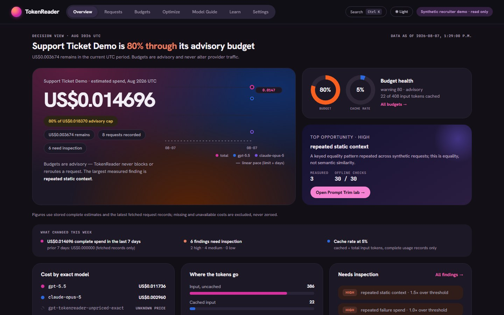

# TokenReader — Technical Case Study

**TokenReader** is a local, metadata-only Windows desktop application that records how an
application uses LLM tokens, estimates cost from exact dated provider price schedules, raises
advisory budgets and explainable findings, and tests whether a leaner prompt preserves required
structure. It never stores prompt or response content. It was built as **TokenOps**, carried the
working name **Aura** for two phases, and was renamed once, under a written migration contract, in
August 2026.

> ### Portfolio case study — source not published
>
> This repository contains **documentation only**. It holds no application source code, tests,
> package manifests, configuration, database schemas, migrations, scripts, installers, or build
> output. The TokenReader implementation lives in a private repository and is not distributed here.
>
> Everything below describes a **clean-machine-qualified development build validated against
> deterministic fixtures**. No real provider request was ever made, no production deployment or
> external beta exists, and there are no users, customers, or revenue outcomes to report.
>
> **This repository is not open source.** No permission is granted to reuse, modify, redistribute,
> host, or deploy Mattie Labs' original materials. See the [rights notice](RIGHTS.md);
> [NOTICE.md](NOTICE.md) is the primary detailed notice.

*Every screen in this case study renders synthetic fixture data. The `Synthetic recruiter demo ·
read only` chip is part of the product, not part of the screenshot. Screenshots were regenerated on
2026-09-03 from the static demo built at source commit `1f17420`.*

---

## What this project is now

The first version of this case study, published on 2026-08-10, described a browser dashboard and
gateway at the end of a four-week local MVP. Since then the project became a Windows application and
went through the parts of shipping software that a demo never shows:

| Phase | What was built | Evidence |
|---|---|---|
| Desktop foundation | Electron shell with a sandboxed renderer, a typed preload bridge, and a supervised, packaged Python gateway authenticated over loopback | Security harness asserts the exact bridge surface at runtime |
| Credentials and providers | Provider keys only in Windows Credential Manager; a rotatable local SDK token; live forwarding to exactly two official endpoints, off by default | Tests in both runtimes; frozen-gateway scenarios with no network |
| Recovery and privacy operations | Backup, staged restore, staged schema upgrade with verified pre-upgrade backup and rollback, retention, selective purge, privacy receipts, reviewed diagnostics | Lifecycle lock and receipt tests; Sandbox scenarios |
| Product shell | Seven destinations, first-launch onboarding with two equal paths, an assisted installer with a Windows 11 x64 guard, repair, upgrade, and an uninstall data choice | Automated axe and contrast gates; installer contracts scripted |
| Clean-machine qualification | One fresh Windows Sandbox per scenario, a thirteen-scenario matrix, a manual accessibility review | **215 / 215 assertions** on the current installer; three real product defects found and fixed |
| Licensing, updates, signing | Ed25519 offline licences enforced by the gateway, signed update manifests with opt-in checks, an Authenticode signing-ready pipeline, release bundles with SBOMs and provenance | Test-signed update installed in a Sandbox; production trust roots committed empty |
| The rename | TokenOps → TokenReader across 246 files, with a data-root and credential migration for existing installs and a branding gate that fails if compatibility debt outlives its code | Legacy-upgrade scenario 43 / 43 |

Each row is expanded in its own document below.

## The user and the problem

The intended user is a technically fluent solo developer or small AI team. They ship LLM-backed
features and then cannot answer basic operational questions from a provider invoice.

An invoice reports a monthly total. It does not tell you which application request consumed which
tokens, whether usage was cached, reasoned, or written to cache, why a cost estimate is incomplete
rather than zero, or whether a proposed prompt reduction quietly deleted a required instruction.

TokenReader sits between an application's official provider SDK and the upstream API, forwards the
native request unchanged, and records content-free operational evidence on the way through. It is
deliberately an **instrument, not a controller**. It does not route, retry, enforce budgets, or
rewrite prompts in the live request path.

## Status

**TokenReader 0.3.0, unsigned development build, clean-machine qualified on 2026-08-28.** External
beta is blocked on things that do not exist yet: a production code-signing certificate, production
licence and update keys, an update domain, and a public releases repository. Every gate that
depends on them fails closed rather than pretending.

Validation still runs against a deterministic fixture upstream over real localhost HTTP using the
official OpenAI and Anthropic Python SDKs. Live provider forwarding is implemented, off by default,
gated behind a licence and an explicit per-provider opt-in, and has never been exercised against a
real provider.

## Core capabilities

| Capability | What it does |
|---|---|
| Native provider-compatible gateway | Forwards OpenAI Responses and Anthropic Messages traffic unchanged, including streaming, with zero retries |
| Usage normalization | Maps provider-specific usage into shared fields without flattening cached, reasoning, or cache-write categories |
| Exact dated pricing | Matches on provider, exact model, mode, UTC date, and context band. No prefix, family, or nearest-model guessing |
| Estimated cost | Independently rounded integer micro-USD components reconciled to a total, with honest incomplete states |
| Advisory budgets | UTC-month limits per project that warn and never block, delay, reroute, or modify traffic |
| Explainable findings | Six bounded metadata findings that each cite a measured value, a configured threshold, and what to verify |
| Keyed equality fingerprints | Reveal repeated context without storing readable text, with the equality leakage disclosed |
| Prompt Trim | A deterministic, conservative, opt-in, in-memory suggestion lab that protects structure it cannot prove is safe to touch |
| Offline evaluation | A fixed 30-ticket synthetic corpus with deterministic rubrics and a content-free report |
| Windows desktop application | Electron shell, packaged gateway, Credential Manager, per-user NSIS installer with repair, upgrade, and uninstall contracts |
| Recovery and privacy operations | Metadata-only backups, staged restore and upgrade, retention, selective purge with receipts, reviewed diagnostic bundles |
| Offline licensing and signed updates | Portable signed licence with no activation server; consent-gated signed updates; signing-ready release pipeline |
| Static recruiter demo | The same React views over a checked synthetic snapshot, with no backend, database, key, or network |

## Interface design

The dashboard is one React presentation layer shared by three modes: connected browser development,
the static demo, and the desktop shell. It is designed as an engineering instrument rather than a
growth dashboard: no decorative KPIs, no fabricated comparisons, no zero where the honest answer is
"unavailable".

A sticky top bar carries the brand orb, seven destinations as a pill strip (Overview, Requests,
Budgets, Optimize, Model Guide, Learn, Settings), a command palette on Ctrl/⌘-K that indexes screens,
fetched trace IDs, and observed models, a session theme toggle, and a mode chip that states the
truth about the data source. Hanken Grotesk carries prose and hierarchy; Spline Sans Mono carries
identifiers, timestamps, and tabular numbers. Both are self-hosted, because the content security
policy allows no runtime font request.

There are light and dark themes, and every informational text and surface pair in both is gated to
WCAG AA contrast by a test that parses the design tokens. Where the design handoff's muted shades
fell below AA, the nearest passing step was used instead. The theme follows the OS preference and
can be toggled for the session only, because the product writes nothing to browser storage and that
invariant outranked the handoff's "remember the theme" note.

Model Guide and Learn are deliberately honest destinations. Model Guide shows observed exact model
IDs and pricing provenance and labels task guidance as unavailable. Learn has structure and no
fabricated lessons. The supported minimum viewport is 320px; the pill strip scrolls rather than
hiding a destination.

## Architecture overview

An application's official SDK is pointed at the local gateway. The gateway assigns a trace
identifier, strips credentials and internal headers, validates the Host header, refuses client-chosen
upstreams, and forwards to its single configured upstream with no retries. The native JSON or SSE
response streams back unmodified.

On a separate path, the gateway derives allowlisted metadata, normalizes provider-reported usage,
matches an exact dated price schedule, computes an integer micro-USD estimate, and commits the whole
record transactionally to local SQLite. A generated, drift-checked API contract feeds the React
dashboard. Business calculations are not duplicated in the browser.

Details: [architecture and data flow](docs/02-architecture-and-data-flow.md).

## The Windows desktop application

The desktop shell wraps the same gateway and dashboard as one Windows 11 x64 application. The
renderer is sandboxed and context-isolated with no Node integration. It reaches the outside world
only through a preload bridge of named methods, which a security harness asserts at runtime. The
main process validates every call and brokers HTTP to a packaged Python gateway child that binds
loopback, receives its bootstrap over stdin, and requires a per-launch 256-bit session secret.

Provider keys live only in Windows Credential Manager, read by the main process through a
repository-owned adapter over the Win32 credential APIs. There is no plaintext fallback: without
the vault, fixture mode continues and live mode is unavailable. Saving a key never enables live mode
and never triggers a verification request. Saved keys report "Saved — not verified".

Nothing external happens on first launch. Onboarding offers two equal starts, explore with fixture
data or connect providers, and the fixture sample request is sent by the main process through the
authenticated local route with a constant synthetic prompt. It is refused while a provider is in
live mode, so it can never incur a charge.

Details: [Windows desktop application](docs/11-windows-desktop-application.md).

## The metadata-only privacy boundary

Content retention was considered and **rejected outright**, not made opt-in. Provider and Prompt
Trim content is processed in memory and discarded. Raw bodies and events, credentials, arbitrary
headers, HMAC key material, provider outputs, and fingerprint values are absent from the database,
logs, management APIs, exports, backups, diagnostic bundles, screenshots, and the static snapshot.

The desktop phases extended the boundary rather than relaxing it. Backups are metadata-only.
Diagnostic bundles are built from a field allowlist and previewed before export. Licence validation
and update checks carry no usage data. There is no telemetry and no upload service of any kind.

Two deliberate, narrowly scoped exceptions exist and are labelled as such: the tracked public-safe
synthetic evaluation corpus, and one approved synthetic Prompt Trim example inside the demo snapshot.

Details: [privacy and security](docs/06-privacy-and-security.md).

## One cost trace, end to end

The Overview reports **$0.014696** of complete estimated spend, from the snapshot field
`complete_estimated_cost_micro_usd = 14696`. One synthetic request, `trc_demo_01_…`, contributes
1,770 micro-USD of that total:

| Step | Value |
|---|---|
| Normalized usage | 72 input tokens (0 cached), 47 output tokens |
| Matched schedule | `openai-gpt-5.5-standard-lt272k-2026-08-07` |
| Input component | 72 tokens at $5.00 / million → **360 micro-USD** |
| Output component | 47 tokens at $30.00 / million → **1,410 micro-USD** |
| Reconciled total | **1,770 micro-USD** |
| Cost status | `complete`, so it contributes to its project's advisory budget |
| Evidence route | `#/requests/trc_demo_01_…` |

Every component is independently rounded half-up and the total is the exact sum of stored components,
so the figure on the Overview can be walked back to a specific request, a specific token count, and a
specific dated rate. **These are estimates derived from published rates. They are not provider
invoices**, and they exclude taxes, credits, negotiated rates, and non-token charges.

Details: [cost traceability](docs/03-cost-traceability.md).

## Prompt Trim and evaluation

Prompt Trim proposes only the removal of an exact duplicate unprotected line, keeps the first
occurrence, preserves order, and reconstructs output solely from suggestions the user selects. It
protects code fences, quoted examples, JSON-like and XML-like blocks, placeholders, negation,
numbered steps, direction-sensitive statements, explicit `[PROTECT]` spans, and marked legal or
policy text.

A fixed corpus of exactly **30 versioned synthetic tickets**, dataset
`tokenreader-synthetic-tickets-v1` with fingerprint
`a122f59b91daef64f34631938afcd07bc1a01d1da5e9e7e60e2b4f3c790f4514`, exercises it offline:

| Offline gate | Result |
|---|---|
| Tickets passed | **30 / 30** |
| Protected-span checks | **26 / 26** |
| Expected-change checks | **30 / 30** |
| No-change checks | **21 / 21** |
| Structural checks | **150 / 150** |
| Mandatory failures | **0** |
| Live evaluation | `not_run` |
| Quality retention | `unavailable_no_live_provider_run` |

**What this proves:** the implemented deterministic checks behaved exactly as declared on this fixed
synthetic dataset. **What it does not prove:** semantic equivalence for arbitrary prompts, general
model quality, or production savings. Approximate count reduction is not a tokenizer claim and
shorter does not imply better.

Details: [Prompt Trim and evaluation](docs/05-prompt-trim-and-evaluation.md).

## Clean-machine qualification

Host-machine testing is not clean-machine evidence, so every installer scenario runs in its own
fresh Windows Sandbox with networking and every redirection disabled, a read-only input mapping,
and one writable evidence folder. The matrix covers fresh install with and without a desktop
shortcut, same-version repair, uninstall with preservation and with deletion, port conflict, path
and locale handling, unsupported-system refusal, the offline licence lifecycle, a test-signed update
install, the legacy-to-TokenReader migration, and a fresh TokenReader install.

Against the current installer, **12 applicable scenarios ran and 215 of 215 assertions passed**, one
scenario (prior-version upgrade) was recorded as not applicable because no earlier TokenReader
release exists, and the manual accessibility checklist was signed off on 2026-08-28.

The matrix earned its keep by finding defects that host validation could not see:

- **A crash at exit on every real launch.** The packaged app died inside a native module's DLL
  teardown whenever it was started without console handles, which is exactly how a user starts it
  from a shortcut. Three plausible fixes were tried and rejected in fresh Sandboxes before the
  accepted one.
- **A migration that silently reset user state.** The legacy-upgrade scenario failed on a stable
  port number and led to a one-field mismatch between the packaged lifecycle protocol and its
  reader, masked by a test stub that had been cast in a way that disabled type checking.
- **An updater that failed open.** The third-party updater accepted an unsigned installer when its
  signature-verification helper could not run. The adapter now verifies the download itself.

Details: [clean-machine qualification](docs/12-clean-machine-qualification.md).

## Licensing, updates, and signing

Commercial use is a one-time lifetime licence: a signed file, at most 8 KB of canonical JSON, with
no activation server, no continuous connection, no usage reporting, and no hardware binding. The
desktop main process validates it for the user interface and the gateway re-validates the exact
bytes for enforcement. Without a gateway-accepted licence, live mode downgrades to fixture,
supplied credentials are dropped, and live upstream resolution refuses. Everything local works
without a licence. The product never holds data hostage.

Updates use signed release manifests verified before the third-party updater's feed metadata is
believed, automatic checks default off, and download and install each require an explicit click.
The signing pipeline enumerates every shipped binary and fails closed in release mode on anything
unsigned, wrong-publisher, or untimestamped. Three trust roots (licence, update, Authenticode) are
never interchangeable, and both production Ed25519 registries are committed empty.

Details: [licensing, updates, and signing](docs/13-licensing-updates-and-signing.md).

## The rename

Renaming a product that already has installed users is a migration, not a find-and-replace. Every
one of roughly 1,630 old-brand occurrences across 246 files was classified first: active identity,
compatibility adapter, historical evidence, third-party terminology, generated artifact, or
ambiguous. The NSIS upgrade GUID and the migration revision IDs were kept on purpose. Existing
installations move their data root and credentials once, in a staged copy that keeps the legacy
install as rollback material until the renamed gateway proves readiness. A branding gate scans every
tracked file and every built surface, and fails if an allowlisted compatibility entry stops matching
the code that justifies it.

Details: [the rename](docs/14-the-rename.md).

## Static recruiter demo

A read-only build renders the real dashboard components over a deterministic synthetic snapshot. Only
the client data adapter changes between connected, static, and desktop modes, so the demo shows the
actual interface rather than a mockup. It has no gateway, database, credentials, analytics,
browser-storage writes, or outbound request. Every screen carries a synthetic read-only chip.

The demo is run locally and is **not deployed or hosted anywhere**.

Details: [static recruiter demo](docs/08-static-recruiter-demo.md).

## Verification summary

Recorded against source commit `1f174203c363e43757010a9af703c04dd7b148b1` (2026-08-28), on Windows:

| Check | Result |
|---|---|
| Gateway tests | 359 passed |
| Dashboard tests | 164 passed, including axe scans over every destination and the two-theme contrast gate |
| Desktop tests | 226 passed |
| Issuer tool tests | 8 passed |
| Type checking | Strict mypy; strict TypeScript across dashboard, desktop, and issuer tools |
| Formatting and lint | Ruff format and lint; PowerShell syntax |
| Migrations | Upgrade, downgrade, and re-upgrade passed; head at `0005_privacy_operations` |
| Dependency audits | pip-audit and npm audit clean across dashboard, desktop, and issuer tools |
| Builds | Connected, static-demo, and packaged desktop builds; unsigned NSIS installer |
| SDK paths | Official OpenAI and Anthropic SDKs, regular and streaming, over real localhost HTTP |
| Packaged runtime | Electron security harness 15 / 15; packaged smoke 13 / 13; licence and loopback update harnesses |
| Scans | Secret, evaluation-drift, snapshot-drift, generated-contract, bundle, packaging, qualification-bundle, and active-branding checks over source and built surfaces |
| Release pipeline | Signing inventory (development, correctly `NotSigned`); test-certificate signing; release-bundle generation and inspection; release-mode gate refused the development bundle |
| Clean-machine qualification | 12 applicable Sandbox scenarios, 215 / 215 assertions, against installer sha256 `c520975d…c26e6` |
| Manual accessibility review | Signed off 2026-08-28 in an interactive Sandbox against the same installer |
| Real provider requests | **None.** No real key was read; live evaluation was not run |

Remote GitHub Actions passed on the Week 4 source commit when the first version of this case study
was published. The evidence for every later phase is the local validation gate on Windows plus the
Sandbox qualification; this case study does not cite CI for those commits.

Details: [testing and validation](docs/07-testing-and-validation.md).

## Important limitations

- Fixture-backed results are **not** production evidence. There are no users, no adoption, no
  measured savings, and no real-world cost outcomes.
- Costs are estimates, not invoices.
- Live-provider behaviour is implemented but has never been exercised against a real provider.
  Quality retention for Prompt Trim is **unavailable**.
- Windows 11 x64 only. No Windows 10, ARM64, macOS, or Linux.
- The current build is an **unsigned development build**. Qualification applies to that exact
  artifact and nothing else; any product change voids it.
- SQLite has no application-level encryption. Backups are unencrypted and unsigned. A fully
  compromised machine, or malicious software running as the same user, is outside the boundary.
- Keyed fingerprints disclose repetition. That equality leakage is documented, not hidden.
- Licence files are portable by design, so sharing one is an accepted commercial risk rather than
  something the product tries to prevent.
- No accessibility or security certification is claimed. The accessibility work is tested,
  browser-reviewed, and operator-reviewed behaviour, not an audited conformance claim.
- Docker remains locally unverified and is not the supported path.
- There is no deployment, hosted demo, release, tag, or external beta.

Details: [limitations and next steps](docs/10-limitations-and-next-steps.md).

## AI-assisted development

Alex Mattie defined the problem, scope, constraints, privacy decisions, acceptance gates, phase
boundaries, and release decisions. The implementation was **substantially produced with AI coding
assistance**, under Alex's direction and review. Alex personally performed the manual accessibility
reviews in the Sandbox and signed off each qualification.

The tests, fixtures, twenty-two architecture decision records, phase execution records, validation
scripts, and build log are traceable evidence of what the system does and how it was checked. They
are not a claim that every source file was hand-written independently. This disclosure is
deliberate: presenting AI-assisted work as unaided engineering would undermine the honesty the
project is otherwise built around.

Details: [AI-assisted development](docs/09-ai-assisted-development.md).

## Documentation index

| Document | Covers |
|---|---|
| [01 — Product overview](docs/01-product-overview.md) | User, problem, scope, locked decisions, explicit non-goals |
| [02 — Architecture and data flow](docs/02-architecture-and-data-flow.md) | Gateway boundaries, evidence path, streaming finalization, decisions on record |
| [03 — Cost traceability](docs/03-cost-traceability.md) | Usage normalization, exact schedule matching, rounding, the worked trace |
| [04 — Budgets and findings](docs/04-budgets-and-findings.md) | Advisory budget model, six findings, thresholds and their limits |
| [05 — Prompt Trim and evaluation](docs/05-prompt-trim-and-evaluation.md) | Conservative rules, the 30-ticket corpus, the `syn-017` trace, live gating |
| [06 — Privacy and security](docs/06-privacy-and-security.md) | Metadata-only boundary, threat model across all phases, controls and residual risk |
| [07 — Testing and validation](docs/07-testing-and-validation.md) | What was verified, how, and what verification does not establish |
| [08 — Static recruiter demo](docs/08-static-recruiter-demo.md) | Snapshot generation, shared components, read-only guarantees |
| [09 — AI-assisted development](docs/09-ai-assisted-development.md) | Division of work, what the evidence supports, honest positioning |
| [10 — Limitations and next steps](docs/10-limitations-and-next-steps.md) | Known boundaries and what would come next |
| [11 — Windows desktop application](docs/11-windows-desktop-application.md) | Trust boundary, credentials, recovery and privacy operations, shell, onboarding, installer contracts |
| [12 — Clean-machine qualification](docs/12-clean-machine-qualification.md) | The Sandbox harness, the scenario matrix, results, and the defects it found |
| [13 — Licensing, updates, and signing](docs/13-licensing-updates-and-signing.md) | Three trust roots, the licence contract, consent-gated updates, the signing-ready pipeline |
| [14 — The rename](docs/14-the-rename.md) | Classifying 1,630 occurrences, migrating installed users, and gating the result |

## Publication status

| Item | Status |
|---|---|
| This case study | Public. Renamed from `tokenops-case-study` to `tokenreader-case-study` on 2026-09-03; the old URL redirects |
| TokenReader application source | **Private and unpublished** (`mattielabs/tokenops`; the private repository keeps its original name) |
| Open-source licence | **None.** The source is proprietary and no reuse licence is granted by either repository |
| Application licence | Signed offline licence contract implemented; no production keys exist and none have been issued |
| Code signing | Signing-ready pipeline; no production certificate exists |
| Deployment / hosted demo | None |
| Release, tag, or external beta | None |
| Clean-machine qualification | Passed on the current unsigned development installer, 2026-08-28 |
| Live provider evaluation | Not run |

[NOTICE.md](NOTICE.md) is the primary detailed notice. See also the
[rights notice](RIGHTS.md).

## Contact

Alex Mattie — Mattie Labs
[mattielabs.ai](https://mattielabs.ai) · [mattielabs@gmail.com](mailto:mattielabs@gmail.com)
