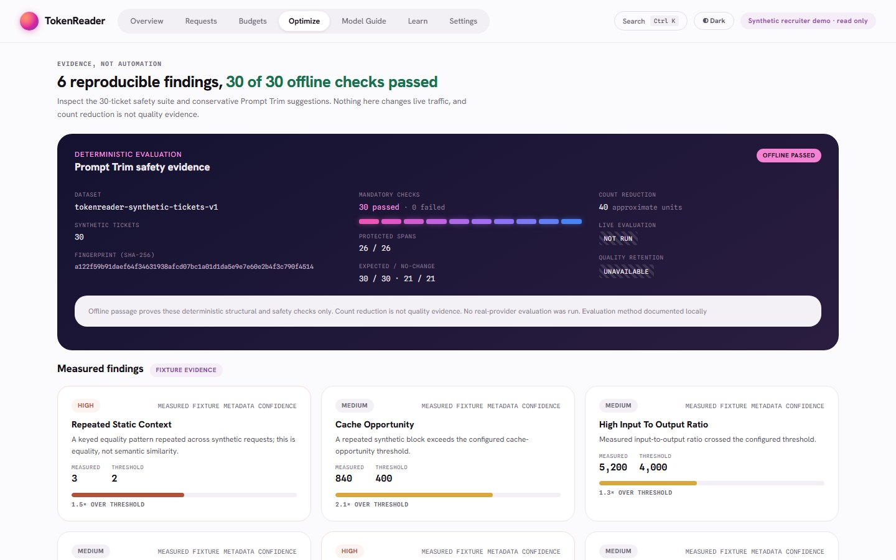

# 05 — Prompt Trim and evaluation

[← Back to the case study](../README.md)

## What Prompt Trim is

A deterministic, conservative, local suggestion lab. It calls no model and no provider, selects
nothing automatically, preserves order, and reconstructs output **only** from suggestions the user
explicitly selects.

Version 1 proposes exactly one kind of edit: removing an exact duplicate unprotected line while
keeping the first occurrence. That is a deliberately unambitious rule, and the ambition is spent
elsewhere, on refusing to touch anything it cannot prove is safe.

Protected structures include closed and unclosed Markdown fences, quoted examples, JSON-like blocks,
XML-like blocks, placeholders and template syntax, negation, numbered steps, direction-sensitive
statements, user-marked `[PROTECT]…[/PROTECT]` spans, and marked legal or policy text. Protected
spans are reported **by type and offset, never as excerpts**.

**A no-change result is a valid, successful result.** This matters more than it sounds: a tool
evaluated on how much it removes will learn to remove things it should not.

## What is stored

A saved comparison contains the project, exact model, count method and counts, an optional safely
calculated cost and schedule reference, protected-type counts, an accepted flag, a version, and a
timestamp.

It never contains prompts, diffs, suggestion excerpts, payloads, or quality claims. Prompt text never
enters logs, the database, findings, exports, URLs, backups, diagnostics, or browser storage. Reset
clears the interface state.

Counts use an approximate whitespace method for the lab and are **labelled approximate**.
Provider-network token counting is not implemented, and one provider's tokenizer is never presented
as another's exact count.

## The evaluation corpus

Exactly **30 invented, public-safe synthetic tickets**, in six groups of five:

| Group | Tests |
|---|---|
| Direction, negation, order | Instructions whose meaning depends on sequence or polarity |
| Structured content | Fences, JSON-like and XML-like blocks |
| Placeholders, quotes, examples | Template syntax and quoted material |
| Protected policy and safety | Legal, policy, and user-marked spans |
| Deterministic workflows | Fixed procedures that must survive intact |
| Redundancy and adversarial cases | Repetition designed to bait an over-eager trimmer |

Each ticket declares a stable ID and version, expected change state, protected structures and
invariants, allowed rule IDs, a deterministic rubric, a count source, sensitivity, tags, rationale,
and whether it is live-evaluable.

The corpus is `tokenreader-synthetic-tickets-v1` with canonical SHA-256 fingerprint
`a122f59b91daef64f34631938afcd07bc1a01d1da5e9e7e60e2b4f3c790f4514`. That digest is **unkeyed**,
because the corpus is public; it is an integrity check, unrelated to the keyed HMAC fingerprints
used for request equality. The fingerprint changed at the rename because the dataset identifier is
part of the fingerprinted file. The rename commit touched only that identifier and the runner
identifier in the corpus; the thirty tickets themselves are unchanged from the first version of this
case study, which recorded fingerprint `872cb97c…b834892`.

## The offline runner

The runner validates schema, count, order, and coverage, then applies Prompt Trim **twice** to check
determinism. It verifies expected and no-change states, byte-level preservation of protected spans,
rule boundaries, full reconstruction from all suggestions, required and forbidden fragments,
structural invariants, stable counts, and explainable rubrics.

Supported rubric methods: exact normalized value, valid JSON or schema, required labels and facts,
ordered sequence, numeric equality, set membership, and placeholder preservation.

The checked report contains IDs, counts, rules, pass/fail state, versions, and aggregate evidence,
**never prompts, revisions, diffs, or outputs**. Any mandatory failure fails the whole gate, so an
average cannot hide a safety regression.

## Results

| Metric | Value |
|---|---|
| Dataset | `tokenreader-synthetic-tickets-v1` |
| Tickets | 30 / 30 passed, 0 failed, 0 unavailable |
| Mandatory failures | 0 |
| Protected-span checks | 26 / 26 passed |
| Expected-change checks | 30 / 30 passed |
| No-change checks | 21 / 21 passed |
| Structural checks | 150 / 150 passed |
| Approximate count reduction | 463 → 423 units (40 units) |
| Live evaluation state | `not_run` |
| Quality retention state | `unavailable_no_live_provider_run` |

## A single ticket, traced

Ticket **`syn-017`** is a protected-policy case:

| | |
|---|---|
| Expected state | `no_change_expected` |
| Protected class | `legal_or_policy` |
| Mandatory | yes |
| Rules that fired | **none** |
| Change observed | none |
| Approximate counts | **14 → 14** |
| Rubric method | `required_facts` |
| Rubric result | passed |
| Ticket result | **passed** |

Prompt Trim identified the declared protected structure, proposed no edit, reconstructed the prompt
deterministically, retained its required fragments, and recorded counts and rubric status. The prompt
text itself did not enter the report or any persisted record, which is why this page can state the
result precisely without quoting the ticket.

This is the case that most clearly justifies the design: the correct behaviour for verbose legal text
is to leave it completely alone, and the evaluation treats doing nothing as a pass.

## What passing does and does not establish

**It establishes** that the implemented deterministic checks behaved exactly as declared on this
fixed synthetic dataset.

**It does not establish:**

- semantic equivalence for arbitrary prompts;
- general model quality;
- production savings;
- that a shorter prompt is a better or equivalent prompt.

Count reduction is an approximate structural measurement, reported separately from safety, and is
explicitly **not** quality evidence.

## Optional live evaluation — built, gated, never run

Live evaluation exists in code and is off by default. Executing it requires **all** of:

1. an explicit enablement environment flag;
2. an exact acknowledgement string covering provider data sharing and possible cost;
3. an exact provider and model, a request cap, and a calculable cost cap;
4. a standard provider environment key, read **only after** the preceding gates pass.

Upstream hosts are allowlisted to the official provider endpoints; the client accepts no arbitrary
remote URL. There are no retries. Reports retain only exact run identity and aggregate rubric
classifications: retained, regression, improvement, inconclusive, or unavailable.

A dry-run manifest can be inspected safely and makes no request. During Week 4 the manifest planned
60 requests across 30 tickets with a conservative maximum of 492,795 micro-USD, beneath the explicit
cap, and issued nothing. Automated tests exercise the regular and streaming live paths against
controlled localhost fake upstreams only.

**No real provider evaluation was ever executed, and no real key was ever read.** Live evaluation is
also explicitly barred from being used for repository validation, so the test suite can never become
dependent on a paid call.

---

Previous: [04 — Budgets and findings](04-budgets-and-findings.md) · Next: [06 — Privacy and security](06-privacy-and-security.md)
