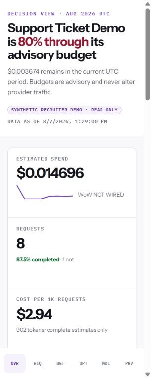

# 07 — Testing and validation

[← Back to the case study](../README.md)

All figures below were recorded against source commit
`4e7aff9c1681a38fb86e1aa1d12905512741cff9`, on Windows, using Python 3.12 and Node.js 24.

## The repository gate

A single validation entry point runs the full static gate: shell syntax checks for both PowerShell
and POSIX scripts, Python formatting and lint, strict type checking, a secret and tracked-artifact
scan, evaluation-drift and snapshot-drift checks, a static-demo scan, a generated-API-contract drift
check, an isolated migration cycle, the backend test suite, a clean dependency install and audit,
strict TypeScript checking, the frontend test suite, and both production builds.

| Check | Result |
|---|---|
| Backend tests | **121 passed** |
| Frontend tests | **15 Vitest tests passed** |
| Strict mypy | passed across **37 source files** |
| Ruff format and lint | passed |
| Strict TypeScript | passed |
| Migrations | upgrade, downgrade, and re-upgrade passed |
| Migration head | unchanged at `0003_week3_dashboard_optimization` |
| Dependency audit | **161 packages, zero vulnerabilities** |
| Builds | connected and static-demo production builds passed |
| Scans | secret, evaluation, snapshot, screenshot, bundle, and generated-contract checks passed |

Runtime and browser workflows are kept separate from the static gate because they start isolated
local services.

## What the tests actually exercise

**Real HTTP, real SDKs, deterministic upstream.** The four SDK paths — OpenAI regular, OpenAI
streaming, Anthropic regular, Anthropic streaming — run the official Python SDKs against the gateway
over actual localhost HTTP, not an in-process test client. The upstream is a deterministic fixture
serving recorded provider JSON and SSE.

This is the design choice that gives the numbers their meaning. The SDK does its real content
negotiation, header handling, streaming parse, and error handling; only the provider's non-determinism
and its bill are removed.

Coverage includes:

- provider usage normalization for both providers, including cached, reasoning, and cache-write
  categories, and the partial, missing, and invalid classifications;
- exact price-schedule matching, including deliberate zero-match and ambiguous-match cases;
- cost calculation, independent component rounding, and total reconciliation;
- streaming finalization, including interrupted streams that must retain only usage already observed;
- advisory budget thresholds at 50%, 80%, and 100%;
- all six finding types against their configured thresholds;
- Prompt Trim safety regressions across every protected structure;
- the full 30-ticket offline evaluation;
- the live-evaluation protocol and its gates, against controlled localhost fake upstreams only;
- Host, Origin, request-size, and defensive-header hardening, with deterministic error responses;
- log, database, sidecar, management-response, and export privacy scans;
- migration upgrade, downgrade, re-upgrade, and preservation of data written by earlier versions;
- static snapshot generation, drift detection, bundle scanning, and hash-route behaviour.

## Runtime acceptance

A separate runtime pass starts the fixture, gateway, and dashboard on loopback against an isolated
database and fingerprint key, then verifies liveness and readiness, runs the four SDK paths, confirms
that credentials and internal headers stop at the gateway, checks that complete usage and cost
records persisted, and runs privacy scans across the database and its sidecars, the log files,
management responses, and exports.

It ends by stopping every service and confirming the ports are closed. Both the connected dashboard
and the static preview were checked in a browser, with an empty console.

## Browser and responsive review

Desktop (1440×1000) and minimum-width mobile (320×800) layouts were reviewed. At 320px the final
document scroll width equalled its usable client width, confirming there was no page-level horizontal
overflow; wide charts and tables retain bounded local scroll containers. Semantic navigation,
labels, a skip link, status text that does not rely on colour alone, visible focus indicators, and
reduced-motion behaviour were reviewed. Frontend tests cover loading, empty, error, chart geometry,
budget, optimization, Prompt Trim, selected filter state, focus management, and reset states.

This is **tested and reviewed behaviour, not an accessibility certification**. No formal WCAG
conformance audit was performed, and no pixel-snapshot claim is made.

## Drift protection

Three artifacts are generated and checked rather than hand-maintained: the offline evaluation
summary, the static demo snapshot, and the API contract. Each has a `--check` mode that fails on
drift.

This closes the failure mode where documentation and reality diverge silently — the evaluation
numbers quoted in this case study cannot go stale without the build failing first.

## Remote CI

GitHub Actions run `31284853455` completed successfully in the private source repository against
source commit `4e7aff9c1681a38fb86e1aa1d12905512741cff9`. The run is not publicly accessible. All four
jobs passed: `backend`, `frontend`, `direct-runtime`, and `docker`. The direct-runtime job exercised
the POSIX workflow on Linux. The Docker job parsed the Compose configuration and built the gateway
and dashboard images; it did not start a container or composed stack.

## What validation does not establish

- **It is fixture evidence, not production evidence.** No real provider request was made and no real
  key was read.
- **It is not a security audit.** No third-party review or penetration test was performed.
- **It is not an accessibility certification.**
- **Passing CI is not production evidence.** It verifies the checked workflows against this source
  commit, not a deployed or user-facing system.
- **Docker remains locally unverified.** Images build in CI and Compose parses, but no container or
  composed stack has been started or exercised anywhere.
- **There is no production or real-user evidence** of any kind.
- Test counts measure coverage of intended behaviour. They are not proof of correctness for inputs
  outside the fixture set.

---

Previous: [06 — Privacy and security](06-privacy-and-security.md) · Next: [08 — Static recruiter demo](08-static-recruiter-demo.md)
