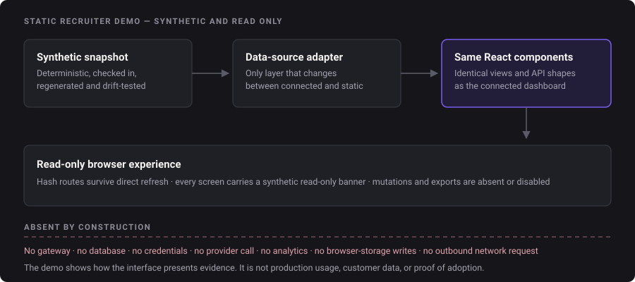

# 08 — Static recruiter demo

[← Back to the case study](../README.md)

## The problem it solves

A reviewer should be able to see the actual interface without installing anything, without a
provider key, and without the project owner exposing production data, because there is no production
data and there never will be under the metadata-only boundary.

The usual answers are bad. A recorded video cannot be explored. A separate marketing mockup drifts
from the real product and quietly becomes a lie. A hosted live instance needs a backend, a database,
credentials, and a deployment the project has explicitly not authorised.

## The approach

Generate a deterministic synthetic snapshot, check it into the repository, and feed it to the **same
React components** the connected dashboard and the desktop shell use. Only the client transport
changes: HTTP for browser development, the snapshot adapter for the demo, the preload bridge for the
desktop.

Because business calculations live in the backend and the frontend renders what it is given, the
static build cannot accidentally implement its own version of the cost logic. What a reviewer sees is
the real presentation layer over real API shapes.

## What the snapshot contains

Requests and request detail, normalized usage, exact pricing and cost state, advisory budgets,
findings, privacy state, the offline evaluation summary, and exactly one allowlisted synthetic Prompt
Trim example.

It is built to exercise the states that matter for review rather than a flattering happy path: eight
requests across both providers, five with complete cost estimates and three deliberately incomplete
(one unknown price, two with missing usage), one upstream failure, two streaming and six
non-streaming, and three budgets sitting at 50%, 80%, and 100%.

Showing incomplete and failed states in the demo is the point. A cost tool that only ever displays
clean data has not demonstrated the hard part.

## Read-only by construction

The demo has no gateway, no database, no credentials, no analytics, no browser-storage writes, no
provider call, and no automatic external request.

- Every screen carries a `Synthetic recruiter demo · read only` chip in the top bar.
- Budget, project, pricing, fingerprint, and comparison mutations are absent or disabled with
  explicit read-only text.
- Licence and update surfaces state honestly that they are unavailable outside the desktop.
- Exports are unavailable.
- Routes use the URL fragment, so a direct refresh works on a basic static server without a rewrite
  rule.
- Loaded assets stay local, including the self-hosted fonts; the bundle is scanned to confirm no
  external request.

Pricing provenance recorded in the snapshot is rendered as plain text in static mode rather than as
navigation, so the read-only build has nothing to click out to.

## Verification

The snapshot generator has a check mode that detects drift, and a separate scan verifies mode flags,
the 30-ticket evaluation state, uniqueness of the approved Prompt Trim example, paths and secrets,
the absence of browser-storage writes, and the built bundle. The active-branding gate scans the demo
bundle as one of its built surfaces. A missing or stale snapshot fails the build rather than
silently shipping old numbers.

Build output is ignored by version control and is explicitly **not** publication evidence.

## The screenshots in this repository

The five screenshots under `assets/screenshots/` were regenerated on 2026-09-03 from the static demo
built at source commit `1f17420`, at 1440×900 for the desktop views and 503×1088 for the narrow
view, with the colour scheme pinned to light for four of them and dark for one. They are the
published artifact. The demo itself runs locally and **is not deployed or hosted anywhere**; this
case study does not link to a live instance.

---

Previous: [07 — Testing and validation](07-testing-and-validation.md) · Next: [09 — AI-assisted development](09-ai-assisted-development.md)
